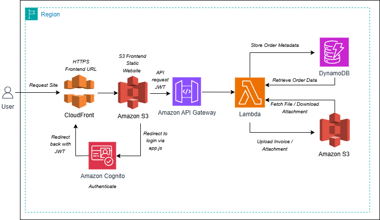

# AWS Serverless Order Management Application

## Project Overview

This project demonstrates a **serverless Order Management Application** built on AWS using Terraform.

The application enables users to:
- Authenticate using Amazon Cognito
- Create and manage orders via a web interface
- Store order data in DynamoDB
- Automatically generate invoices
- Store invoices in Amazon S3

The system is fully serverless, meaning no servers are managed manually. AWS services handle scalability, availability, and execution.

---

## AWS Services Used

The following AWS services are used in this project:

### Compute
- AWS Lambda → Executes backend business logic

### API Layer
- Amazon API Gateway → Exposes REST API for frontend

### Authentication
- Amazon Cognito → User authentication (Hosted UI)

### Database
- Amazon DynamoDB → Stores order data

### Storage
- Amazon S3 → Stores generated invoice files
- Amazon S3 (Static Hosting) → Hosts frontend

### Content Delivery
- Amazon CloudFront → Provides HTTPS access to frontend

### Security & Access
- AWS IAM → Roles and permissions for services

### Infrastructure
- Terraform → Infrastructure as Code (IaC)
- AWS CLI → Configuration and deployment support

---

## Architecture Diagram

## Architecture Overview

This project follows a **serverless architecture** on AWS.

### Architecture Components

- Frontend → Hosted on Amazon S3 and delivered via CloudFront (HTTPS)
- Authentication → Managed by Amazon Cognito (Hosted UI)
- API Layer → Amazon API Gateway
- Backend → AWS Lambda function
- Database → Amazon DynamoDB
- Storage → Amazon S3 (for invoice files)

---

## Application Workflow

1. User accesses the application using the CloudFront URL

2. User clicks **Login / Sign Up**
   - Redirected to Amazon Cognito Hosted UI
   - User completes authentication

3. After successful login:
   - User is redirected back to the frontend
   - Authentication token is received

4. User fills in order details:
   - Customer Name
   - Email
   - Product Name
   - Quantity
   - Address

5. User clicks **Place Order**

6. Frontend sends request to API Gateway

7. API Gateway triggers Lambda function

8. Lambda function:
   - Validates request data
   - Generates unique Order ID
   - Stores order in DynamoDB
   - Creates invoice file (.txt)
   - Uploads invoice to S3

9. Lambda returns response:
   - Order ID
   - Invoice file location

10. Frontend displays confirmation:
   - Order created successfully
   - Order ID
   - Invoice reference

---

## Test Cases

The following test cases were performed to validate the application functionality.

---

### 1. S3 Bucket Creation

- Verified that the S3 bucket was successfully created

---

### 2. S3 Upload Test

- Verified that objects can be uploaded to S3

---

### 3. DynamoDB Table Creation

- Verified that DynamoDB table was created

---

### 4. DynamoDB Insert Test

- Verified that order data is stored in DynamoDB

---

### 5. IAM Roles Configuration

- Verified IAM roles and permissions for Lambda execution

---

### 6. Lambda Function Creation

- Verified Lambda function was successfully created

---

### 7. Lambda Execution Test

- Verified Lambda execution and response

---

### 8. Cognito User Pool Setup

- Verified Cognito user pool creation

---

### 9. Cognito Custom Domain

- Verified hosted UI domain configuration

---

### 10. CloudFront Deployment

- Verified frontend is accessible via CloudFront

---

### 11. Cognito Login Test

- Verified user login using Cognito Hosted UI

---

### 12. Cognito OTP Verification

- Verified email OTP confirmation during signup

---

### 13. Order Placement (Frontend)

- Verified order submission from frontend

---

### 14. DynamoDB Final Verification

- Verified order record created in DynamoDB

---

### 15. S3 Invoice Generation

- Verified invoice file created in S3 bucket

---

## Issues & Fixes

---

### Issue 1: Terraform Access Denied (DynamoDB)

#### Error
While running `terraform plan`, the following error occurred:

> AccessDeniedException: dynamodb:DescribeTable

#### Root Cause
The IAM user used for Terraform did not have sufficient permissions to access DynamoDB resources.  
Terraform requires read permissions (like `DescribeTable`) during the planning phase.

#### Resolution
- Attached **AdministratorAccess** policy to the IAM user
- Re-ran Terraform commands

#### Result
Terraform executed successfully without errors.

---

### Issue 2: Cognito Hosted Login Page Not Working

#### Error
> "Login pages unavailable. Please contact an administrator."

#### Root Cause
Managed Login was enabled in Cognito, but **no login style was assigned** to the app client.

#### Resolution
- Navigated to **Cognito → Managed Login**
- Created a new login style
- Assigned the style to the app client
- Verified:
  - Callback URL
  - Sign-out URL
  - OAuth scopes (`openid`,`email`)

#### Result
Cognito hosted login page loaded successfully.

---

### Issue 3: Cognito Callback URL Not Accepting S3 Website URL

#### Error
Cognito rejected S3 static website URL as callback URL.

#### Root Cause
- S3 static website URLs are **HTTP only**
- Cognito requires **HTTPS URLs**

#### Resolution
- Created **CloudFront distribution**
- Connected CloudFront to S3 frontend
- Used CloudFront HTTPS URL in Cognito settings

#### Result
Authentication flow worked correctly with secure redirection.

---

### Issue 4: API Request Failed (CORS Error)

#### Error
> "Failed to fetch"  
> "Request header field authorization is not allowed"

#### Root Cause
Frontend was sending an `Authorization` header, but:
- API Gateway had `authorization = NONE`
- CORS settings did not allow this header

#### Resolution
- Removed `Authorization` header from frontend request (`app.js`)

#### Result
API requests worked successfully and orders were processed.

---

## Conclusion

This project demonstrates a complete serverless application using AWS services, including authentication, API integration, data storage, and file processing, all deployed using Terraform.

---

## Author

Mrugdha Sankhe